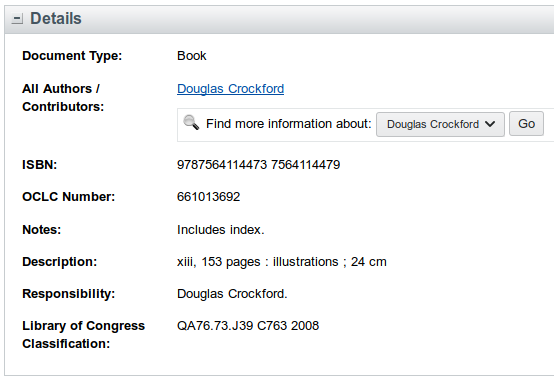

WorldCat does not list Library of Congress Classification (LCC)
on the title pages of its catalog.
However, sometimes the LCC is stored in the `rft.identifier` attribute
of a query string stored in the title of a certain `` element
in the "Get This Item" section.

For example, the call number "QA76.73.J39 C763 2008"
is stored in this page for "[JavaScript: the good parts](https://www.worldcat.org/title/javascript-the-good-parts/oclc/661013692)"
by Douglas Crockford.

    

This userscript extracts the LCC from the page
and displays it in the "Details" section.

Hosted here on GreasyFork:

https://greasyfork.org/en/scripts/370817-show-lcc-on-worldcat
